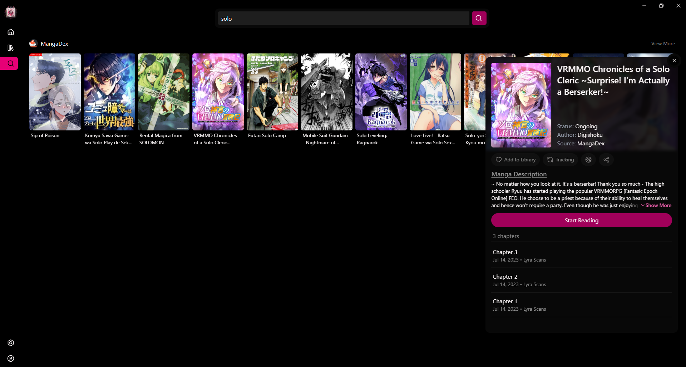

# ⛩️ Transeki ⛩️

  

  
A native desktop manga reader built for local library safety.

  
  

## 🧐 The Problem

Even though I mostly read on my phone now (using _Yokai_), I used to read on PC and I feel the pain.

- I hate having 10 browser tabs open to search different sources.
- I hate bookmarking URLs only to find them dead a month later.
- I want a local library that survives even if the source breaks.

## 🛠️ The Project

My goal is a **Native Desktop Manga Reader** that prioritizes local library management.

I specifically learned **React**, **Vite**, **Tailwind**, and **GitHub Actions** to build this. I wanted full control over the app, so AI is used to help me learn and plan, not to write the core logic.

### Tech Stack

- **Core:** Electron + React + Vite
- **Styling:** TailwindCSS
- **Why Electron?** Because I prefer JavaScript. _(Yes, I know it consumes 300MB of RAM, but... it is what it is)_

## 🚧 Current Status (Early WIP)

Started `January 11, 2026 at 2:25 AM`.

- **Browse Page:** Functional for one hard coded source, but basic. I'm planning to remake the layout soon to match my vision better and support multiple sources.
- **Details Panel:** Opens as soon as you click a manga card. Currently uses fetches demo data because the plugin system is being built.  
  _> It only changes the tile and cover in the panel to the manga clicked to show it works._
- **UI:** Clean and functional, but I'm obsessing over small details (like corner radius) as I learn.

## 🗺️ Roadmap

1. Build the actual **Plugins System** (Inspired by Tachiyomi's extensions architecture).
2. Finish the **Library Page** (The core feature).
3. Build the **Reader** and **Settings**. (Vertical focused at first).
4. Offline Downloads & Auto-updates.

_> Long term dream? Maybe sync/accounts, but that's a long way off._

## ⚡ Future plugin system (For Devs)

If you want to help grow the app with your own source, the plugin system will be open for anyone to build on. It will be inspired by Tachiyomi's architecture, but with a focus on ease of development and security.

- **Separated Repository:** The plugin system will be in its own repo to allow for independent development and versioning as well as to keep the main app on it's own.
- **Formatting:** Plugins will be built using a standardized format (probably JSON + JavaScript) to ensure compatibility and ease of use.
- **Security:** Since plugins will run in the main process or the user's system. There will be strict guidelines and reviews for plugins to ensure they are safe and reliable
- **Documentation:** Comprehensive documentation and examples will be provided to help developers get started with building their own plugins.

## ⚠️ The "Developer" Disclaimer

I have AuDHD, so my coding schedule is... chaotic.

- I might code 4 hours one week, then nothing for two weeks.
- I sometimes get stuck fixing a 2px misalignment instead of building big features.
- This is a slow-burn hobby project. I am not promising a release date.

## 🤝 Community & Discord

If you want to hang out, watch the progress, or give feedback on the UI, join the Discord.

- Discord: [discord.gg/hazHVm3nXe](https://dicord.gg/hazHVm3nXe)
- Reddit: [r/Transeki](https://www.reddit.com/r/Transeki)
- Trello: [Transeki Roadmap](https://trello.com/b/5c0MDlAv/transeki)  
  _Generated by with help from AI to keep me on track and be more detailed, but feel free to check it out and give feedback on the roadmap._  
  _**Note:** All feature plans are decided by me, **not** AI._
- GitHub: [Rinpyre/Transeki](https://github.com/Rinpyre/Transeki)
